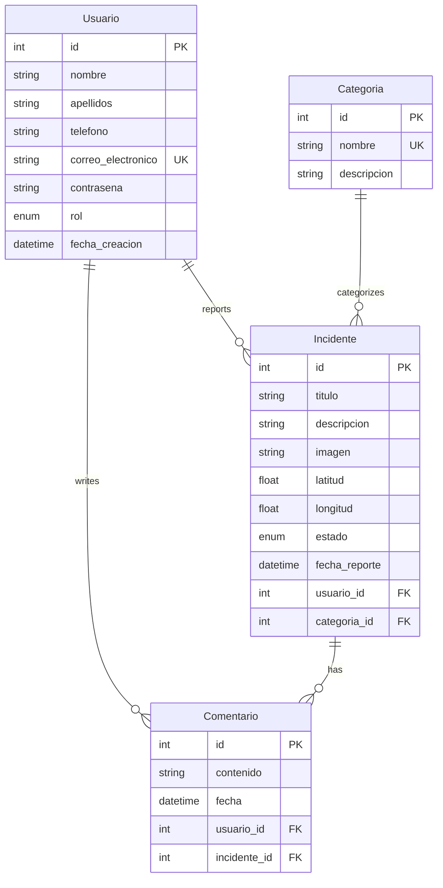

## Overview

Alerta Ciudadana uses SQLAlchemy ORM models to define the database schema. The system consists of four main entities: Users (Usuario), Incidents (Incidente), Categories (Categoria), and Comments (Comentario).

## Entity Relationship Diagram



## Usuario Model

Represents system users, including both citizens and administrators.

**Table Name:** `usuarios` (src/models/usuario.py:13)

### Fields

<ResponseField name="id" type="integer" required>
  Primary key, auto-incremented
</ResponseField>

<ResponseField name="nombre" type="string(100)" required>
  User's first name
</ResponseField>

<ResponseField name="apellidos" type="string(100)" required>
  User's last name(s)
</ResponseField>

<ResponseField name="telefono" type="string(20)" required>
  Contact phone number
</ResponseField>

<ResponseField name="correo_electronico" type="string(100)" required>
  Email address - must be unique across all users
</ResponseField>

<ResponseField name="contrasena" type="string(255)" required>
  Bcrypt-hashed password
</ResponseField>

<ResponseField name="rol" type="RolUsuario" required>
  User role enum: "ciudadano" or "admin"
</ResponseField>

<ResponseField name="fecha_creacion" type="datetime">
  Account creation timestamp (UTC), defaults to current time
</ResponseField>

### Role Enum

**RolUsuario** (src/models/usuario.py:8-10):

- `ciudadano`: Standard citizen user who can report incidents and add comments
- `admin`: Administrator with elevated privileges for managing incidents

### Relationships

- **incidentes**: One-to-many relationship with Incidente (usuario.incidentes)
- **comentarios**: One-to-many relationship with Comentario (usuario.comentarios)

### Constraints

- Primary key on `id` with index
- Unique constraint on `correo_electronico`
- All fields except `fecha_creacion` are NOT NULL

## Incidente Model

Represents urban incidents reported by citizens.

**Table Name:** `incidentes` (src/models/incidente.py:16)

### Fields

<ResponseField name="id" type="integer" required>
  Primary key, auto-incremented
</ResponseField>

<ResponseField name="titulo" type="string(100)" required>
  Brief title describing the incident
</ResponseField>

<ResponseField name="descripcion" type="string(500)" required>
  Detailed description of the incident
</ResponseField>

<ResponseField name="imagen" type="string(255)">
  URL or filename of associated image (optional)
</ResponseField>

<ResponseField name="latitud" type="float" required>
  Geographic latitude coordinate of incident location
</ResponseField>

<ResponseField name="longitud" type="float" required>
  Geographic longitude coordinate of incident location
</ResponseField>

<ResponseField name="estado" type="EstadoIncidente">
  Current status enum, defaults to "pendiente"
</ResponseField>

<ResponseField name="fecha_reporte" type="datetime">
  Timestamp when incident was reported (UTC), defaults to current time
</ResponseField>

<ResponseField name="usuario_id" type="integer" required>
  Foreign key to Usuario - the reporting user
</ResponseField>

<ResponseField name="categoria_id" type="integer" required>
  Foreign key to Categoria - the incident category
</ResponseField>

### Estado Enum

**EstadoIncidente** (src/models/incidente.py:9-13):

<ResponseField name="pendiente" type="string">
  Incident has been reported but not yet reviewed
</ResponseField>

<ResponseField name="en revisión" type="string">
  Incident is being reviewed by administrators
</ResponseField>

<ResponseField name="atendido" type="string">
  Incident has been addressed and resolved
</ResponseField>

<ResponseField name="descartado" type="string">
  Incident was reviewed and dismissed
</ResponseField>

### Relationships

- **usuario**: Many-to-one relationship with Usuario (src/models/incidente.py:32)
- **categoria**: Many-to-one relationship with Categoria (src/models/incidente.py:33)
- **comentarios**: One-to-many relationship with Comentario (backref from Comentario model)

### Constraints

- Primary key on `id` with index
- Foreign key `usuario_id` references `usuarios.id`
- Foreign key `categoria_id` references `categorias.id`
- `titulo`, `descripcion`, `latitud`, `longitud`, `usuario_id`, `categoria_id` are NOT NULL

## Categoria Model

Defines incident categories for classification.

**Table Name:** `categorias` (src/models/categoria.py:6)

### Fields

<ResponseField name="id" type="integer" required>
  Primary key, auto-incremented
</ResponseField>

<ResponseField name="nombre" type="string(100)" required>
  Category name (e.g., "Robo", "Fuga de agua") - must be unique
</ResponseField>

<ResponseField name="descripcion" type="string(255)">
  Optional detailed description of the category
</ResponseField>

### Relationships

- **incidentes**: One-to-many relationship with Incidente (backref from Incidente model)

### Constraints

- Primary key on `id` with index
- Unique constraint on `nombre`
- Only `nombre` is required (NOT NULL)

### Example Categories

Common incident categories might include:

- Robo (Theft)
- Fuga de agua (Water leak)
- Baches (Potholes)
- Alumbrado público (Street lighting)
- Basura acumulada (Accumulated garbage)

## Comentario Model

Represents comments or updates on incidents.

**Table Name:** `comentarios` (src/models/comentario.py:8)

### Fields

<ResponseField name="id" type="integer" required>
  Primary key, auto-incremented
</ResponseField>

<ResponseField name="contenido" type="string(500)" required>
  Comment text content
</ResponseField>

<ResponseField name="fecha" type="datetime">
  Timestamp when comment was posted (UTC), defaults to current time
</ResponseField>

<ResponseField name="usuario_id" type="integer" required>
  Foreign key to Usuario - the comment author
</ResponseField>

<ResponseField name="incidente_id" type="integer" required>
  Foreign key to Incidente - the incident being commented on
</ResponseField>

### Relationships

- **usuario**: Many-to-one relationship with Usuario (src/models/comentario.py:19)
- **incidente**: Many-to-one relationship with Incidente (src/models/comentario.py:20)

### Constraints

- Primary key on `id` with index
- Foreign key `usuario_id` references `usuarios.id`
- Foreign key `incidente_id` references `incidentes.id`
- `contenido`, `usuario_id`, `incidente_id` are NOT NULL

## Pydantic Schemas

Each model has corresponding Pydantic schemas for request/response validation:

### Usuario Schemas

Defined in `src/schemas/usuario.py`:

- **UsuarioBase**: Base fields (nombre, correo_electronico, rol)
- **UsuarioCreate**: For creating users (adds contrasena)
- **UsuarioUpdate**: For updating users (adds contrasena)
- **Usuario**: Response schema (adds id, fecha_creacion)
- **UsuarioRegister**: Frontend registration (includes apellidos, telefono)
- **UsuarioLogin**: Login credentials (correo_electronico, contrasena)

### Incidente Schemas

Defined in `src/schemas/incidente.py`:

- **IncidenteBase**: Base fields for all incident operations
- **IncidenteCreate**: For creating incidents (inherits from base)
- **IncidenteUpdate**: For updating incidents (inherits from base)
- **Incidente**: Response schema (adds id, fecha_reporte)

### Comentario Schemas

Defined in `src/schemas/comentario.py`:

- **ComentarioBase**: Base fields (contenido, usuario_id, incidente_id)
- **ComentarioCreate**: For creating comments (inherits from base)
- **ComentarioUpdate**: For updating comments (inherits from base)
- **Comentario**: Response schema (adds id, fecha)

### Categoria Schemas

Defined in `src/schemas/categoria.py`:

- **CategoriaBase**: Base fields (nombre, descripcion)
- **CategoriaCreate**: For creating categories (inherits from base)
- **CategoriaUpdate**: For updating categories (inherits from base)
- **Categoria**: Response schema (adds id)

## Database Session Management

Database operations use SQLAlchemy sessions managed through dependency injection:

```python
def get_db():
    db = SesionLocal()
    try:
        yield db
    finally:
        db.close()
```

This ensures proper connection lifecycle management and automatic cleanup after each request (src/config/db.py:15-20).

## Common Queries

### Get User with Related Incidents

```python
user = db.query(Usuario).filter(Usuario.id == user_id).first()
incidents = user.incidentes  # Access via relationship
```

### Get Incident with Comments

```python
incidente = db.query(Incidente).filter(Incidente.id == incidente_id).first()
comentarios = incidente.comentarios  # Access via backref
```

### Filter Incidents by Status

```python
pending = db.query(Incidente).filter(
    Incidente.estado == EstadoIncidente.pendiente
).all()
```

### Get Incidents by Category

```python
incidentes = db.query(Incidente).filter(
    Incidente.categoria_id == categoria_id
).all()
```
